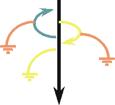
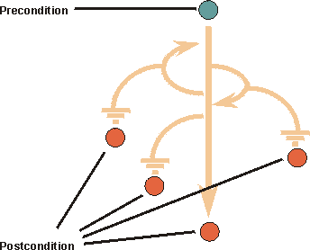

 A use case describes what the system must do to provide value to the stakeholders.
---

Relationships

Related Elements|
  * [Detail Use Cases and Scenarios](../../../../practice-technical/use_case_driven_dev/guidances/guidelines/detail-use-cases-and-scenarios.md)
  * [Use Case](../../workproducts/use-case.md)
  * [Use-Case Model](../../workproducts/use-case-model.md)
---|---

Main Description

###  Overview

A use case describes the interactions between one of more [Actor](actor.md)s and the system in order to provide an observable result of value for the initiating actor.  The functionality of a system is defined by different use cases, each of which represents a specific goal \(to obtain the observable result of value\) for a particular actor.  In an automated teller machine shown in Figure 1, the Bank Customer can withdraw cash from an account, transfer funds between accounts, or deposit funds to an account. These correspond to specific goals that the actor has in using the system.
 [📄](../../../../images/descriptions/fig1_atm_ex.md "Image description")

> > Figure 1: ATM Use-Case Example

Each use case is associated with a goal of one of the actors. The collection of use cases constitutes all the possible ways of using the system. You should be able to determine the goal of a use case simply by observing its name.  A use case describes the interactions between the actor\(s\) and the system in the form of a dialog between the actor\(s\) and the system, structured as follows:

  1. The actor <<does something>>
  2. The system <<does something in response>>
  3. The actor <<does something else>>
  4. The system ...

Each dialog of this form is called a "Flow of Events".  Because there are many flows of events possible for achieving the goal \(for example, the flow may differ depending upon specific input from the actor\), and there are situations in which the goal cannot be achieved \(for example, a required network connection is currently unavailable\), each use case will contain several flows, including one "Basic Flow of Events" and several "Alternative Flows".  The Basic Flow of Events specifies the interactions between the actor\(s\) and the system for the ideal case, where everything goes as planned, and the actor's goal \(the observable result of value\) is met. The basic flow represents the main capability provided by the system for this use case.  As the name implies, Alternative Flows specify alternative interactions associated with the same goal.  Closely related to use cases is the concept of a scenario. A scenario is a _**specific**_ flow of events, for a _**specific**_ set of inputs to the system, states of the system, and states of the system's environment. Scenarios are closely related to test cases.

###  Properties of Use Cases

####  Name

Each use case should have a name that indicates what is achieved by its interaction with the actors. The name may have to be several words to be understood. Note: No two use cases can have the same name.

####  Brief Description

The brief description of the use case should reflect its purpose.

####  Flow of Events

#####  Flow of Events - Contents

The flow of events should describe the use case's flow of events clearly enough for an outsider to easily understand. Remember, the flow of events should represent _what_ the system does, not _how_ the system is design to perform the required behavior.  Follow these guidelines for the contents of the flow of events:
  * Describe how the use case starts and ends.
  * Describe what data is exchanged between the actor and the use case.
  * Do not describe the details of the user interface, unless it is necessary to understand the behavior of the system. Specifying user interface details too early will limit design options.
  * Describe the flow of events, not only the functionality. To enforce this, start every action with "When the actor ... ".
  * Describe only the events that belong to the use case, and not what happens in other use cases or outside of the system.
  * Avoid vague terminology.
  * Detail the flow of events. Specify what happens when, for each action. Remember this text will be used to identify test cases.

If you have used certain terms in other use cases, be sure to use the exact same terms in this use case, and that the meaning of the terms is consistent. To manage common terms, put them in a glossary.

#####  Flow of Events - Structure

The two main parts of the flow of events are **basic flow of events** and **alternative flows of events**. The basic flow of events should cover what "normally" happens when the use case is performed. The alternative flows of events cover behavior of optional or exceptional character in relation to the normal behavior, and also variations of the normal behavior. You can think of the alternative flows of events as detours from the basic flow of events, some of which will return to the basic flow of events and some of which will end the execution of the use case.  The straight arrow in Figure 2 represents the basic flow of events, and the curves represent alternative paths in relation to the normal. Some alternative paths return to the basic flow of events, whereas others end the use case.   [📄](../../../../images/descriptions/ucstrct.md "Image description") Figure 2: Typical structure of a use case flow of events  Both the basic and alternative flows should be further structured into steps or sub-flows. In doing this, your main goal should be readability of the text. A guideline is that a sub-flow should be a segment of behavior within the use case that has a clear purpose, and is "atomic" in the sense that you do either all or none of the actions described.

####  Special Requirements

In the Special Requirements of a use case, you describe all the requirements associated with the use case that are not covered by the flow of events. These are non-functional requirements that will influence the design. See also the discussion on non-functional requirements in [Concept: Requirements](requirements.md).

####  Preconditions and Post-conditions

A **precondition** is the state of the system and its environment that is required before the use case can be started. Post-Conditions are the states the system can be in after the use case has ended. It can be helpful to use the concepts of **precondition** and **post-condition** to clarify how the flow of events starts and ends. However, only use them only if the audience for the description of the use case agrees that it is helpful. Figure 3 shows an example.   [📄](../../../../images/descriptions/ucprepst.md "Image description")

> > > Figure 3: Illustration of preconditions and resulting post-conditions

Examples  **A precondition for the use case Cash Withdrawal in the ATM machine:** The customer has a personally issued card that fits in the card reader, has been issued a PIN number, and is registered with the banking system.  **A post-condition for the use case Cash Withdrawal in the ATM machine:** At the end of the use case, all account and transaction logs are balanced, communication with the banking system is reinitialized and the card is returned to the customer.

###  Use-Case Diagrams

You may choose to illustrate how a use case relates to actors and other use cases in a use-case diagram \(in unusual cases, more than one diagram\). This is useful if the use case is involved with many actors, or has relationships to many other use cases. A diagram of this kind is of "local" character, since it shows the use-case model from the perspective of one use case only and is not intended to explain any general facts about the whole use-case model. Refer to [Guideline: Use-Case Model](../../../../practice-technical/use_case_driven_dev/guidances/guidelines/use-case-model-9.md) for more information.

###  Specifying Use Cases

####  How to Find Use Cases

See the [Guideline: Identify and Outline Actors and Use Cases](../../../../practice-technical/use_case_driven_dev/guidances/guidelines/identify-and-outline-actors-and-use-cases.md) for guidance on finding Actors and Use Cases.

####  How a Use Case Evolves

See the [Guideline: Detail Use Cases and Scenarios](../../../../practice-technical/use_case_driven_dev/guidances/guidelines/detail-use-cases-and-scenarios.md) for guidance on evolving use cases.

####  Level of detail necessary in use cases

There will often be use cases in your model that are so simple that they do not need a detailed description of the flow of events, a step-by-step outline is quite enough. The criteria for making this decision is that you don't see disagreement among user kind of readers on what the use case means, and that designers and testers are comfortable with the level of detail provided by the step-by-step format. Examples are use cases that describe simple entry or retrieval of some data from the system.

####  The Scope of a Use Case

It is often hard to decide if a set of user-system interactions, or dialog, is one or several use cases. Consider the use of a recycling machine. The customer inserts deposit items, such as cans, bottles, and crates, into the recycling machine. When she has inserted all her deposit items, she presses a button, and a receipt is printed. She can then exchange this receipt for money.  Is it one use case to insert a deposit item, and another use case to require the receipt? Or is it all one use case? There are two actions, but one without the other is of little value to the customer. Rather, it is the complete dialog with all the insertions, and getting the receipt, that is of value for the customer \(and makes sense to her\). Thus, the complete dialog, from inserting the first deposit item, to pressing the button and getting the receipt, is a complete case of use, a use case.  Additionally, you want to keep the two actions together, to be able to review them at the same time, modify them together, test them together, write manuals for them and in general manage them as a unit. This becomes very obvious in larger systems.
---

More Information

Concepts|
  * [Actor](actor.md)
  * [Requirements](requirements.md)
---|---
