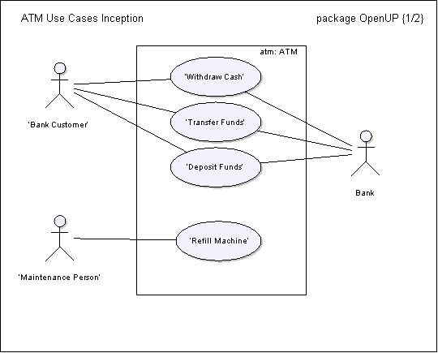

 An example of a Use-Case Model as it would appear in the Inception.
---

Relationships

Related Elements|
  * [Evolution of the Use-Case Model](evolution-of-the-use-case-model.md)
---|---

Main Description

###  1 Introduction

This is an example of a Use-Case Model as it would appear in the Inception. Primary actors and use cases are identified. There may or may not be an outline of the basic flows yet.

###  2 Overview

The Automated Teller Machine is a remote unit connected to the bank computer systems. The purpose of the system is to bring regular bank services closer to the customer and increase the working hours to around the clock. It is also important to decrease the amount of bank cashiers. An ATM withdrawal is less expensive for the Bank than a withdrawal from a teller.

The ATM system requires that each bank customer has an ATM card and remembers his PIN code. The whole security of this system builds on the PIN code.

###  3 Use-Case Diagram

The figure below shows the use-case diagram for the ATM.

 [📄](../../../../images/descriptions/atm_incept_uc_diagram.md "Image description")

###  4 Actors

####  4.1 Bank Customer

This actor represents a person with a valid Bank Card. The Bank Card is theirs and they know the PIN Code.

####  4.2 Bank

This actor represents the financial institution that provides services to the ATM. Responsible for verifying Bank Customers, authorizing transactions and recording completed transactions.

####  4.3 Maintenance Person

This actor represents the person responsible for maintaining the Automated Teller Machine, refilling paper, and replenishing cash.

###  5 Use Cases

#####  5.1.1 Withdraw Cash

This use case describes how the Bank Customer uses the ATM to withdraw money his/her bank account.

#####  5.1.2 Transfer Funds

This use case describes how the Bank Customer uses the ATM to transfer money between different bank accounts.

#####  5.1.3 Deposit Funds

This use case describes how the Bank Customer deposits money to an account.

#####  5.1.4 Refill Machine

This use case describes how the Maintenance Person refills money, receipt paper and envelopes.
---
