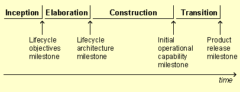

 These are the point at which a phase formally ends, thus providing a checkpoint for whether the project is ready to move to the next phase.
---

Relationships

Related Elements|
  * [Assess Results](../../../iterative_dev/tasks/assess-results-1.md)
  * [Plan Project](../../../release_planning/tasks/plan-project-1.md)
---|---

Main Description

From a development perspective, each iteration provides an increment of functionality to the product. Thus, the end of each iteration corresponds to a checkpoint where the project team demonstrates to stakeholders that the objectives for that iteration have been met.  From a management perspective, the software lifecycle is decomposed over time into four sequential phases, each concluded by a major milestone \[[BOE95](./../../../core.default.nav_view.base/guidances/supportingmaterials/references_C6FF2A8D.html#BOE95)\]. There are four major milestones that provide evaluation criteria at the end of each phase:  **The phases and milestones of a projec** t
 [📄](../../../../images/descriptions/co_phas1.md "Image description") Each phase is a span of time between two major milestones and has specific focus and objectives. At the end of each phase, an assessment is performed to determine whether the objectives of the phase have been met. A satisfactory assessment allows the project to move to the next phase. When a milestone is not met, more iterations in the current phase may be performed before the milestone can be considered complete. Achieving a milestone represents an objective criteria with which to measure progress.  At the end of the [Inception Phase](inception-phase-10.md) is the first major project milestone, or **Lifecycle Objectives Milestone**. At this point, you examine the cost versus benefit of the project and decide either to proceed with the project or to cancel it.  At the end of the [Elaboration Phase](elaboration-phase-10.md) is the second important project milestone, the **Lifecycle Architecture Milestone**. At this point, a baseline of requirements is agreed to, you examine the detailed system objectives and scope, the choice of architecture, and the resolution of the major risks. The milestone is achieved when the architecture has been validated.  At the end of the [Construction Phase](construction-phase-10.md)**** is the third important project milestone, the **Initial Operational Capability Milestone**. At this point, the product is ready to be handed over to the transition team. All functionality has been developed and all alpha testing \(if any\) has been completed. In addition to the software, a user manual has been developed, and there is a description of the current release. The product is ready for beta testing.  At the end of the [Transition Phase](transition-phase-10.md)**** is the fourth important project milestone, the **Product Release Milestone**. At this point, you decide if the objectives were met and whether you should start another development cycle. The Product Release Milestone is the result of the customer reviewing and accepting the project deliverables.
---

More Information

Concepts|
  * [Construction Phase](construction-phase-10.md)
  * [Elaboration Phase](elaboration-phase-10.md)
  * [Inception Phase](inception-phase-10.md)
  * [Transition Phase](transition-phase-10.md)
---|---
