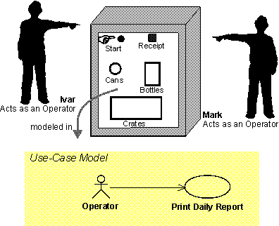
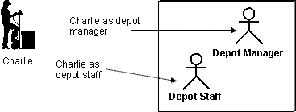

 An Actor is a role that a person or external system plays when interacting with a system. Instances of an Actor can be an individual or an external system.
---

Relationships

Related Elements|
  * [Use Case](use-case-2.md)
  * [Use-Case Model](../../workproducts/use-case-model.md)
---|---

Main Description

To fully understand the system's purpose, you must know who the system is for, that is: Who will use the system? The answer to this question is: the Actors.  An Actor is a role that a person or external system plays when interacting with the system. Instances of an Actor can be an individual or an external system, however each Actor provides a unique and important perspective on the system that is shared by every instance of the Actor.  This difference between an actor and an instance of an actor is illustrated below. Figure 1 shows a case in which Ivar and Mark are operators of a recycling machine. When they are using the machine in this capacity, each is represented by an instance of the actor called Operator that expects certain functionality of the system \(Print Daily Reports in this example\).   [📄](../../../../images/descriptions/md_acto2.md "Image description")

> **Figure 1: Example Actor with multiple instances**

Conversely, the same user can act as several actors \(that is, the same person can take on different roles\). In Figure 2, Charlie uses the Depot-Handling System primarily as Depot Manager, but sometimes he also uses the Depot-Handling System as an ordinary Depot Staff member. Each of these actors expects different functionality of the system.   [📄](../../../../images/descriptions/md_acto3.md "Image description")

> **Figure 2: Example of user playing different roles**
>

Actors help you to identify external interfaces and to determine the scope the system \(what is in the system, vs. what is outside the system boundary\). Each Actor typically has associated use cases which describe what that particular actor expects of the system. It will be very difficult, if not impossible, to assess the completeness of the set of Use Cases without the context provided by the associated Actors. Furthermore, missing an actor may result in missing important stakeholder perspectives, resulting in a solution that does not meet all stakeholder needs.  Hence, identifying the Actors for the system should be done early in the lifecycle.
---
