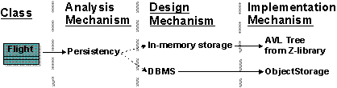
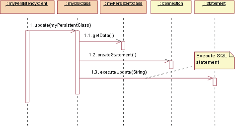
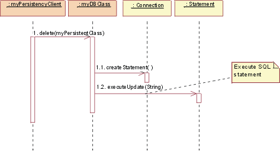

 Examples that show how to describe design mechanisms
---

Relationships

Related Elements|
  * [Architectural Mechanism](../concepts/architectural-mechanism.md)
  * [Design Mechanism](../concepts/design-mechanism.md)
---|---

Main Description

###  Design Mechanism Characteristics and Mapping

Consider the analysis mechanism for **persistence**.
  * There might be a need for many \(2,000\) small objects \(200 bytes each\) to be stored for a few seconds, with no need for them to survive thereafter.
  * There might be a need for several very large objects to be stored permanently on disk for several months, never updated, but with sophisticated means of retrieval.

These objects require different support for persistency. The best option depends on the characteristics of the design mechanism:
  * **In-memory storag****e:** For up to 1 Mb total \(size x volume\); very fast access for read, write, update.
  * **Flash card****:** For up to 8 Mb; slow update and write access; moderate read access.
  * **Binary file****:** For 100 Kb to 200 Mb; slow update; slow read-and-write access.
  * **Database management system \(DBMS\)****:** For 100 Kb and upward \(essentially no upper limit\); even slower update and read-and-write access.

Note that these speeds are rated as slow only as compared to in-memory storage. Obviously, in some environments, caching can improve apparent access times. \(See Figure 1.\)

>  [📄](../../../../images/descriptions/co_dmec1.md "Image description")
**Figure 1. Mapping Analysis Mechanisms to Design Mechanisms and Classes**

###  Mapping Design Mechanisms to Implementation Mechanisms

The **persistence** design mechanisms can be mapped to implementation mechanisms as Figure 2 shows:   [📄](../../../../images/descriptions/co_dmec2.md "Image description") **Figure 2. How persistence design mechanism map to implementation mechanism** A possible mapping between analysis mechanisms and design mechanisms. Dotted arrows mean "is specialized by," implying that the characteristics of the design mechanisms are inherited from the analysis mechanisms but that they will be specialized and refined.  After you have finished optimizing the mechanisms, the following mappings exist \(see Figure 3\):

>  [📄](../../../../images/descriptions/co_dmec3.md "Image description") **Figure 3. Mapping structure after optimizing the mechanisms** The design decisions for a client class in terms of mappings between mechanisms. Flight class needs two forms of persistency**:** **in-memory storage** , implemented by a predefined library routine, and **a database,** implemented with an off-the-shelf ObjectStorage product.

The map must be navigable in both directions to make it easy to determine client classes when changing implementation mechanisms.

####  Refining the mapping between design and implementation mechanisms

Initially, the mapping between design mechanisms and implementation mechanisms is likely to be less than optimal, but it will get the project running, identify unforeseen risks, and trigger further investigations and evaluations. As the project continues and you gain more knowledge, you will need to refine the mapping.  Proceed iteratively to refine the mapping between design and implementation mechanisms. Eliminate redundant paths, working both top-down and bottom-up.  **Working top-down:** When working top-down \(from top to bottom\), new and refined use-case realizations will put new requirements on the necessary design mechanisms through the analysis mechanisms that you need. These new requirements might uncover additional characteristics of a design mechanism, forcing a split between mechanisms. A compromise between the system's complexity and its performance is also necessary:
  * Too many different design mechanisms make the system too complex.
  * Too few design mechanisms can create performance problems for implementation mechanisms that stretch the limits of the reasonable ranges of the values of their characteristics.
**Working bottom-up:** When working bottom-up \(from bottom to top\) and investigating the available implementation mechanisms, you might find products that satisfy several design mechanisms at once, but force some adaptation or repartitioning of your design mechanisms. You want to minimize the number of implementation mechanisms you use, but too few of them can also lead to performance problems.  After you decide to use a DBMS to store class A objects, you might be tempted to use it to store all objects in the system. This could be very inefficient or very cumbersome. Not all objects that require persistency need to be stored in the DBMS. Some objects may be persistent, but one application may access them frequently, while other applications access them only infrequently. A hybrid strategy, in which the object is read from the DBMS into memory and periodically synchronized, may be the best approach.

> **Example** A flight can be stored both in memory for fast access and in a DBMS for long-term persistency. However, this triggers a need for a mechanism to synchronize both.

It is not uncommon to have more than one design mechanism associated with a client class as a compromise between different characteristics.  Because implementation mechanisms often come in bundles in off-the-shelf components \(operating systems and middleware products\), some optimization based on cost, impedance mismatch, or uniformity of style needs to occur. Also, mechanisms are often interdependent, which makes clear separation of services into design mechanisms difficult.

> **Examples**
>
>   * The notification mechanism can be based on the inter-process communication mechanism.
>   * The error reporting mechanism can be based on the persistency mechanism.
>

Refinement continues over the whole Elaboration phase, and is always a compromise between:
  * An exact fit with the requirements of the clients of the design mechanism, in terms of the expected characteristics.
  * The cost and complexity of having too many different implementation mechanisms to acquire and integrate.

The overall goal is always to have a simple, clean set of mechanisms that give conceptual integrity, simplicity, and elegance to a large system.

###  Describing Design Mechanisms

As with analysis mechanisms, design mechanisms can be modeled using a collaboration, which may instantiate one or more architectural or design patterns.

> **Example: A persistence mechanism** This example uses an instance of a pattern for RDBMS-based persistency drawn from [_Java™ Database Connectivity \(JDBC\)_](http://java.sun.com/products/jdbc/index.html). Although we present the design here, JDBC supplies actual code for some of the classes. Therefore, it is a short step from what is presented here to an implementation mechanism.

Figure 4, titled **JDBC: Static view,** shows the classes \(actually, the classifier roles\) in the collaboration.   [📄](../../../../images/descriptions/jdbc1.md "Image description") **Figure 4. JDBC: Static view** The yellow classes are the ones that were supplied. The others, in tan \(myDBClass class and so on\), were bound by the designer to create the mechanism.  In a Java database class, a client will work with a **DBClass** to read and write persistent data. DBClass is responsible for accessing the JDBC database, using the **DriverManager** class. Once a database **connection** is open, the DBClass can then create SQL statements that will be sent to the underlying RDBMS and executed using the **Statement** class. Statement class is what communicates with the database. The result of the SQL query is returned in a **ResultSet** object. The **DBClass** is responsible for making another class instance persistent. It understands the OO-to-RDBMS mapping and can interface with the RDBMS. DBClass flattens the object, writes it to the RDBMS, and then reads the object data from the RDBMS and builds the object. Every class that is persistent has a corresponding DBClass.  The **PersistentClassList** is used to return a set of persistent objects as a result of a database query, for example: "DBClass.read\(\)".  A series of dynamic views follow, in Figures 5 thorough 9, to show how the mechanism actually works.   [📄](../../../../images/descriptions/jdbc2.md "Image description") **Figure5. JDBC: Initialize** Initialization must occur before any persistent class can be accessed.  To initialize the connection to the database, the DBClass must load the appropriate driver by calling the DriverManager getConnection\(\) operation with a URL, user, and password.  The operation getConnection\(\) attempts to establish a connection to the given database URL. The driver manager attempts to select an appropriate driver from the set of registered JDBC drivers.

> **Parameters**
>
>> **URL****:** A database URL in the form jdbc:subprotocol:subname. This URL is used to locate the actual database server and is not Web-related, in this instance.  **user****:** The database user who is making the connection.  **pass****:** The user's password
>
> **Returns**
>
>> A connection to the URL.

 [📄](../../../../images/descriptions/jdbc3.md "Image description") **Figure 6. JDBC: Create** To create a new class, the persistency client asks the DBClass object to create the new class. DBClass creates a new instance of a class "PersistentClass". DBClass object then creates a new Statement object using Connection class createStatement\(\) operation. Statement object runs, and the data is added to the database.   [📄](../../../../images/descriptions/jdbc4.md "Image description") **Figure 7. JDBC: Read** To read a persistent class, the persistency client asks the DBClass object to read. DBClass object creates a new Statement object using Connection class createStatement\(\) operation. The Statement is executed, and the data is returned in the ResultSet object. DBClass object then creates a new instance of the PersistentClass class and populates it with the retrieved data. The data is returned in a collection object, an instance of PersistentClassList class.  **Note:** The string passed to the "executeQuery\(\)" method is not necessarily exactly the same string as the one passed into the method "read\(\)". DBClass object will build the SQL query to retrieve the persistent data from the database, using the criteria passed into the method "read\(\)". This is because the client of the DBClass object does not need to know the internal structure of the database to create a valid query. This knowledge is encapsulated within the object "DBClass".   [📄](../../../../images/descriptions/jdbc5.md "Image description") **Figure 8. JDBC: Update** To update a class, the persistency client asks the DBClass object to update. DBClass object retrieves the data from the given object "PersistentClass". It creates a new object "Statement" using the operation "Connection class createStatement\(\)". Once Statement object is built, the database is updated with the new data from the class.  **Remember:** It is the job of DBClass object to flatten the object "PersistentClass", and write it to the database. That is why it must be retrieved from the given object "PersistentClass" before creating the SQL Statement.  **Note:** In the above mechanism, the PersistentClass must provide access routines for all persistent data so that the DBClass can access them. This provides external access to certain persistent attributes that would have been private otherwise. This is a price you have to pay to pull the persistence knowledge out of the class that encapsulates the data.   [📄](../../../../images/descriptions/jdbc6.md "Image description") **Figure 9. JDBC: Delete** To delete a class, the persistency client asks the DBClass object to delete PersistentClass. DBClass object creates a new object "Statement" using the operation "Connection class createStatement\(\)". Statement object is executed and the data is removed from the database.  In the actual implementation of this design, you would make some decisions about the mapping of the DBClass object to the persistent classes, such as having one DBClass per persistent class and allocating them to appropriate packages. These packages will depend on the supplied java.sql file \(see [JDBC: API Documentation](http://java.sun.com/products/jdbc/index.jsp)\) package that contains the supporting classes "DriverManager", "Connection", "Statement", "ResultSet".
---
